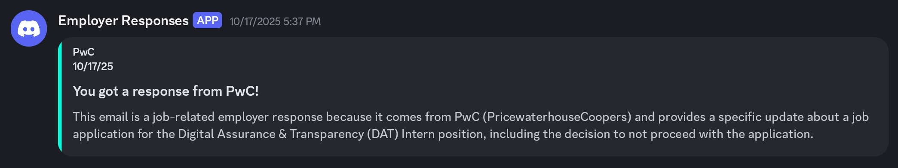
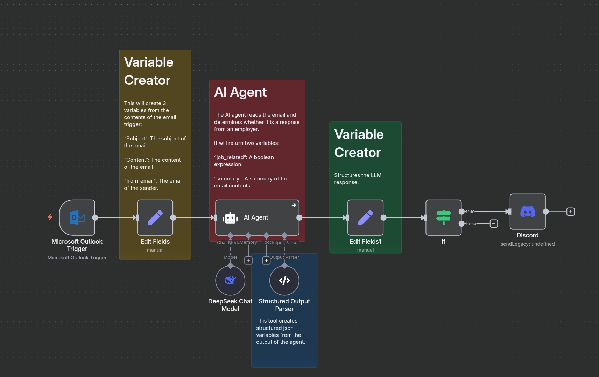

# AI Job Application Alerter (n8n Workflow)

A simple n8n workflow that uses an LLM to monitor an Outlook inbox for job application responses, classify them, and send alerts to a Discord server.

## The Problem

When applying for jobs, I use a dedicated email address. I found that Outlook's "Focused Inbox" feature would often misclassify important emails from potential employers, sending them to the "Other" tab. This meant I was missing responses like interview requests or rejection notices.

## The Solution

To solve this, I built an automation in **n8n** that reads these emails when they arrive in my inbox.

This workflow checks my inbox every minute, uses a Large Language Model (LLM) to determine if an email is a response from an employer, and if it is, instantly sends a formatted summary to a dedicated Discord channel via a webhook.

## Features

- **Real time Monitoring:** Checks outlook inbox every minute.
- **AI Classification:** Uses an LLM to classify emails as "Employer Response" or "Other. based on specified criteria.
- **AI Data Extraction:**
    - Identifies and extracts the **company name**.
    - Generates a **summary** of the email's content.
- **Instant Notifications:** Sends a clean, formatted [Discord Embed](https://www.google.com/search?q=https://discord.com/developers/docs/resources/channel%23embed-object) with all relevant details.

## Workflow Breakdown

1. **Trigger (`Outlook Node`):** Activates every 1 minute, fetching new emails from the inbox.
2. **Extract (**`Edit Field Node`**):** The email body is parsed, and only relevant text elements are extracted.
3. **Classify (`LLM Node`):** The parsed text is sent to an LLM with a prompt to determine if it's a response from an employer. The LLM returns `true` or `false` and a `summary` of the email. 
4. **Format (**`Edit Field Node`**):** The LLM response is formatted into structured JSON with variables `employer`, `summary`, `job_related`.
5. **Condition (`IF Node`):** The workflow proceeds only if the LLM returns `true`.
6. **Notify (`Discord Node`):** The formatted JSON is sent as a POST request to the Discord webhook URL, appearing as a embed in the server.

## Setup & Installation

1. [Get the Workflow](./Email_Classifier.json)
2. **Import to n8n:**
    - Open your n8n canvas.
    - Go to `File` > `Import from File...`
    - Select the downloaded `workflow.json`.
3. **Configure Credentials:**
You will need to create and add credentials in n8n for:
    - **Outlook:** To allow n8n to read your inbox.
    - **LLM Provider:** (e.g., OpenAI, DeepSeek) to provide your API key.
4. **Configure Nodes:**
    - **Outlook Node:** Select your Outlook credentials.
    - **LLM Nodes:** Select your LLM credentials and ensure you select the correct model.
    - **Webhook Node:**
        - Create a webhook in your Discord server (`Server Settings` > `Integrations` > `Webhooks`).
        - Copy the Webhook URL.
        - Paste the URL into the `Webhook URL` field in the n8n node.
5. **Activate:**
Save the workflow and toggle it to **Active**.

## Example Output (Discord Embed)

When a new employer email is detected, a message like this will appear in your Discord channel:

## About This Project

This was a personal project to practice my skills in AI and automation. It solves a simple but annoying problem. I hope this helps you too!

